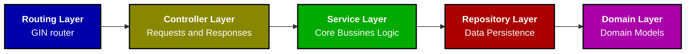

# Project Architecture

The project follows a simple layered architecture with some DDD elements:

## Layers Details

1. **Routing Layer (Gin Router)**:
  - This layer is responsible for handling HTTP requests and routing them to the appropriate controllers.
  - It is implemented in the [gin.go](internal/infrastructure/router/gin.go) file.
  - It acts as the entry point for API requests and defines the endpoints.

2. **Controller Layer**:
  - This layer defines the requests and responses schemas and validations
  - Parses and validates the requests bodies, parameters and headers, validates data types and existence of mandatory parameters.
  - It is implemented in the packages on the [Controllers](internal/interfaces/controllers/) folder.
  - The controllers acts as intermediaries between the routing layer and the service layer, delegating tasks to the appropriate services.

3. **Service Layer**:
  - The service layer encapsultes the core bussines logic ot the application, and orchestates different operations if needed.
  - It is implemented in the packages on the [Services](internal/services/)folder.
  - The services coordinates between the controllers and the repositories, ensuring that the business rules are applied correctly.

4. **Repository Layer**:
  - This layer handles the data persistence and retrieval.
  - It is implemented in the packages on the [Repositories](internal/infrastructure/repositories/) folder.
  - The repositories abstracts the database operations, providing a clean interface for the service layer to interact with the database.

5. **Domain Layer**:
  - This layer represents the model, operations and errors, for each entity of the application.
  - It is implemented in the packages on the [Domain](internal/domain/) folder.
  - The domains represents how the data must be and behave, defining the main data structures and interfaces tha must be complied.

They are some extra packages to handle non business related operations, like configuration or enviroment handler, and database connection handler.